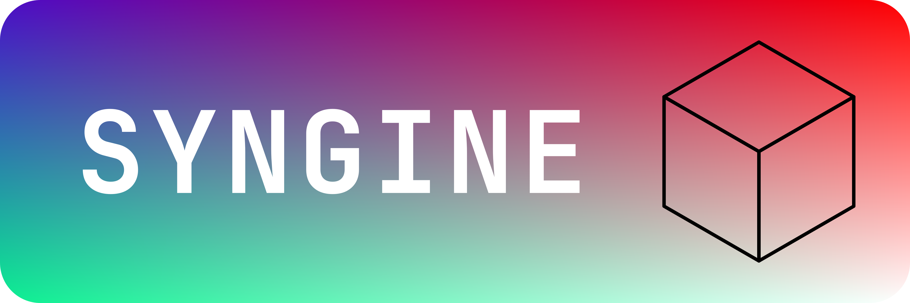

# SynTools
CLI tools used to help make game development with Syngine and Syngine Studio easier. Includes Shader compiler, Asset packager/unpackager, and Scene packager.

# Usage:
## Shader compilation
`syntools shader <fragment_name> <vertex_name> <output_path> [options]`

### Options:

`--compiler=<path>` Path to bgfx shaderc exec, relative to program. (default: ./shaderc). You shouldn't have to change this, as by default, shaderc and syntools are in the same directory.

`--varying=<path>` Path to varying def file. By default, it looks in `fragment_path/varying/fragment_name.vary.[ext]`.

`--src-ext=<path>` The extension of the shader source files. Default is `[frag/vert/vary].sc`

`--out-ext=<path>` The extension of the output binary file. Default `[vert/frag].bin`

`--src-dir=<path>` Source directory for the shaders, relative to program. Regular syntax, `..` and such supported. Default is `gameProject/assets/shaders`

`--include=<path>` Additional includes for shaders. Relative to program, multiple allowed.

### Examples:
`syntools shader space space space_output`
- Will compile shader with fragment & vertex named `space.frag.sc`/`space.vert.sc` into `space_output.bin`
- Assumes shader sources are in same dir as `syntools`, will output to same dir as well.

`syntools shader terrain s s --src-dir=../../assets/shaders/world --src-ext=.shadercode`
- Will compile shader with fragment & vertex named `terrain.frag.shadercode`/`terrain.vert.shadercode` into `terrain.[frag/vert].bin`
- Shader source path is `../../assets/shaders/world`
- Shader extension is `.shadercode`
- Note the replacement of the vertex and output with `s` (means "same"). If either of these are `s`, it will assume the vertex and/or output names are the same as the fragment's name.

## File bundling
`syntools pack <output_file> <file1> <file2> ... [options]`
- Note that`file` can be a relative path to either a literal file, or to a directory, where every file in said dir (non-recursive) will be packaged.

### Options:
`--src-dir=<path>` Path where every file/directory will then be searched from. Very useful for the relative asset paths inside the game. e.g. `--src-dir=./Bakerman.app/Contents/Resources` with `file1` being `shaders` will look for files in src-dir/shaders. This is useful for multi-platform development, as keeping relative paths in the package is essential.

### Example:
`syntools pack meshes.spk meshes`
- Will package all files in `./meshes` into `meshes.spk`

## Asset packaging

## Scene packaging

## Usage in CMake scripts as a post-build step
[Syngine](https://github.com/SentyTek/Syngine) comes with a file bundling step already that packages shaders and assets. Here is how we recommend using SynTools with a Cmake script:
```cmake
include(CMakeParseArguments)

# Creates a custom command that packages files into a single syntools bundle.
#
# Required args:
#   BUNDLE_NAME              Name of the output bundle. ".spk" is appended if missing.
#   OUTPUT_DIRECTORY         Directory where the bundle file is written.
#   SOURCE_DIRECTORY         Base directory used with --src-dir for relative asset paths.
#   INPUT_FILES              Files/directories to pack (relative to SOURCE_DIRECTORY preferred).
#   BUNDLE_FILE_OUTPUT_VAR   Parent-scope variable receiving the output bundle path.
#
# Optional args:
#   DEPENDS                  Extra build dependencies for this bundle command.
function(create_file_bundle)
    set(options "")
    set(oneValueArgs
        BUNDLE_NAME
        OUTPUT_DIRECTORY
        SOURCE_DIRECTORY
        BUNDLE_FILE_OUTPUT_VAR
    )
    set(multiValueArgs
        INPUT_FILES
        DEPENDS
    )

    cmake_parse_arguments(ARG "${options}" "${oneValueArgs}" "${multiValueArgs}" ${ARGN})

    if(NOT ARG_BUNDLE_NAME)
        message(FATAL_ERROR "create_file_bundle: BUNDLE_NAME not provided.")
    endif()
    if(NOT ARG_OUTPUT_DIRECTORY)
        message(FATAL_ERROR "create_file_bundle: OUTPUT_DIRECTORY not provided.")
    endif()
    if(NOT ARG_SOURCE_DIRECTORY)
        message(FATAL_ERROR "create_file_bundle: SOURCE_DIRECTORY not provided.")
    endif()
    if(NOT ARG_INPUT_FILES)
        message(FATAL_ERROR "create_file_bundle: INPUT_FILES not provided.")
    endif()
    if(NOT ARG_BUNDLE_FILE_OUTPUT_VAR)
        message(FATAL_ERROR "create_file_bundle: BUNDLE_FILE_OUTPUT_VAR not provided.")
    endif()
    if(NOT TARGET syntools)
        message(FATAL_ERROR "create_file_bundle: 'syntools' target not found. Ensure it is built before this function is called.")
    endif()

    # Keep bundle naming consistent by always writing .spk bundles.
    set(bundle_file_name "${ARG_BUNDLE_NAME}")
    if(NOT bundle_file_name MATCHES "\\.spk$")
        set(bundle_file_name "${bundle_file_name}.spk")
    endif()

    set(bundle_output_path "${ARG_OUTPUT_DIRECTORY}/${bundle_file_name}")

    # Pack all provided files/dirs while preserving relative in-bundle paths via --src-dir.
    add_custom_command(
        OUTPUT "${bundle_output_path}"
        COMMAND ${CMAKE_COMMAND} -E make_directory "${ARG_OUTPUT_DIRECTORY}"
        COMMAND $<TARGET_FILE:syntools> pack "${bundle_output_path}" "--src-dir=${ARG_SOURCE_DIRECTORY}" ${ARG_INPUT_FILES}
        DEPENDS syntools ${ARG_DEPENDS}
        WORKING_DIRECTORY ${CMAKE_SOURCE_DIR}
        COMMENT "Bundling assets into ${bundle_file_name}"
        VERBATIM
    )

    set(${ARG_BUNDLE_FILE_OUTPUT_VAR} "${bundle_output_path}" PARENT_SCOPE)
endfunction()
```

# Technologies Used
[SCL](https://github.com/MerianBerry/SCL)
